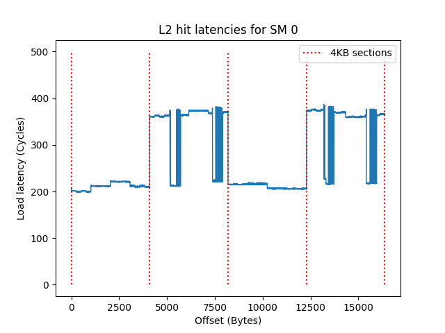
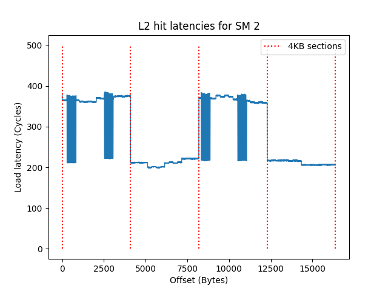
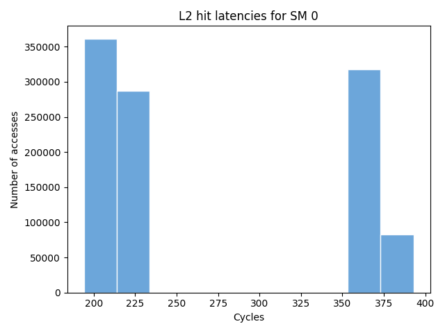

# ampere-L2-partitions-microbenchmarks

This repo is an attempt at reproducing the microbenchmarks [presented at GTC 2021 by Citadel](https://www.nvidia.com/en-us/on-demand/session/gtcspring21-s33322/).









## How to use

```shell
make # to build main
./main > l2_latency_results.csv
python plot_latencies_hist.py
python plot_latencies_vs_offset.py
```

to change the #SMs and TARGET_SMID, modify `main.cu`'s constants at the top of the file...


### Mapping the SM ids to near partition id
```shell
make map
CUDA_VISIBLE_DEVICES=<URDEVICEID> ./map # example: CUDA_VISIBLE_DEVICES=3 ./map
```
